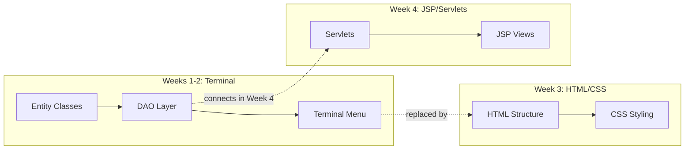
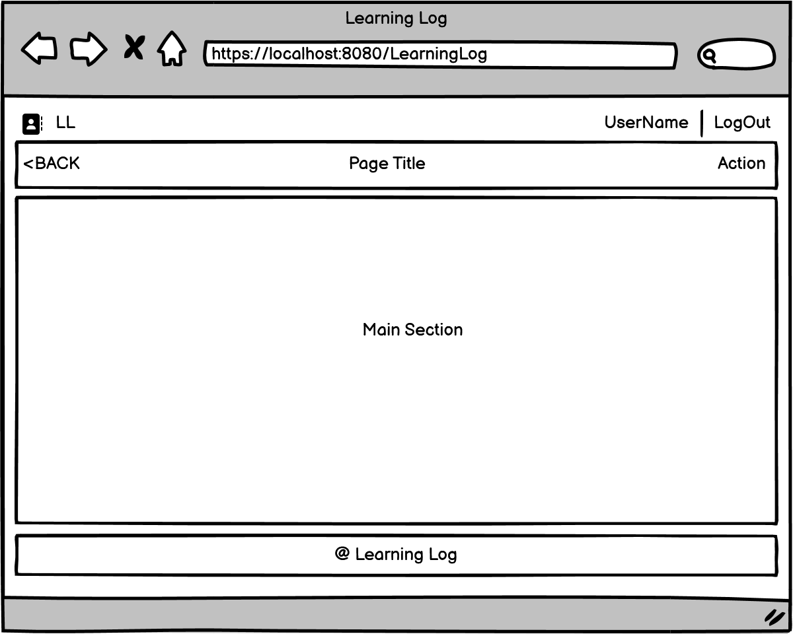
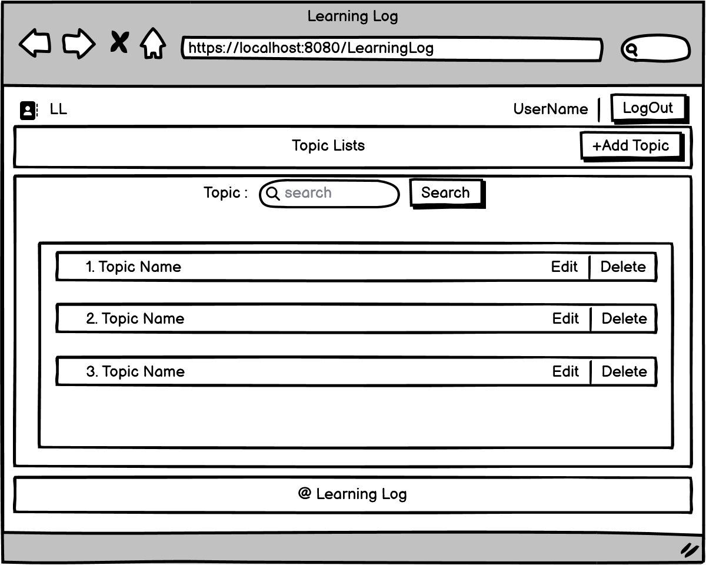
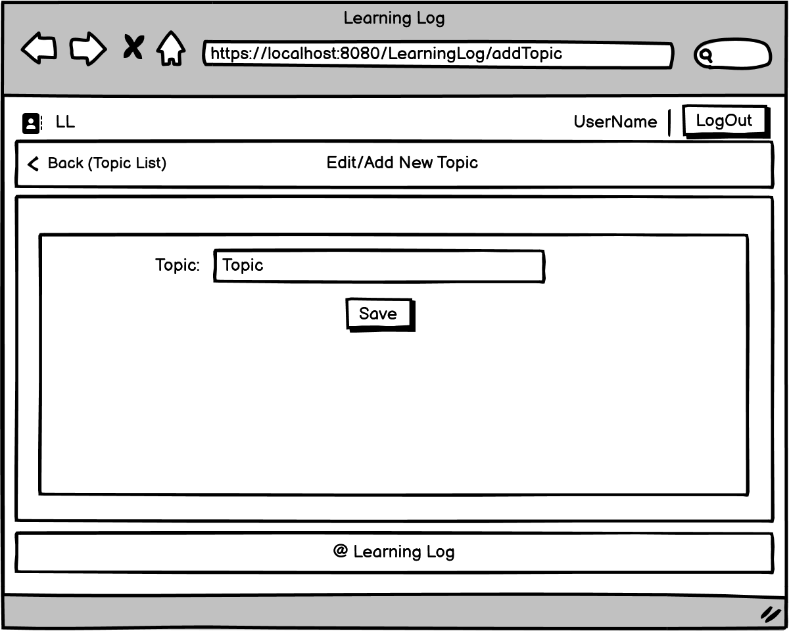

# Learning Logs Web — Tutorial

### Week 3 — Tutorial: HTML/CSS Main Layout + Topic Pages

> *"From terminal to browser — your app gets a face."*

---

## Why This Week Matters

In **Weeks 1-2**, you built the brain of Learning Logs — entities, JDBC, DAO pattern, and a terminal menu. All the data logic works. But real users don't use terminals — they use **web browsers**.

This week, you start building the **web interface**. Before we connect Java to the browser (that's Week 4), we need to build the **HTML structure** and **CSS styling** — the visual layout that users will actually see and interact with.

### Terminal vs Web

| | Terminal (Weeks 1-2) | Web (Weeks 3-4) |
|--|---------------------|------------------|
| **Interface** | Text-based menu | Visual browser page |
| **Input** | Scanner + keyboard | HTML forms + buttons |
| **Output** | System.out.println() | HTML elements |
| **Styling** | ASCII boxes `╔══╗` | CSS flexbox + colors |
| **Navigation** | Number choices (1-6) | Clickable links + navbar |



### What's New This Week

| Concept | What It Does | Where You'll Use It |
|---------|-------------|-------------------|
| **HTML5 Semantic Elements** | `<header>`, `<nav>`, `<main>`, `<footer>` — meaningful structure | `main.html` |
| **CSS Flexbox** | Layout system for arranging elements in rows/columns | `main.css` |
| **CSS Variables** | Reusable color values defined once in `:root` | `main.css` |
| **Responsive Design** | `@media` queries — adapt layout for mobile screens | `main.css` |
| **HTML Forms** | `<form>`, `<input>`, `<label>`, `<button>`, hidden inputs | `topic-list.html`, `topic-add.html` |
| **CSS @import** | Reuse stylesheets by importing from another CSS file | `topic-list.css` |
| **Attribute Selectors** | Target elements by attribute: `button[type="submit"]` | `topic-add.css` |

---

## What's Already Done For You

All Java backend code from Weeks 1-2 is **provided complete** — no Java TODOs this week. The terminal app still works via `mvn compile exec:java`.

Your focus is entirely on **six new files**: the main layout + topic pages.

| PROVIDED (from Weeks 1-2) | YOUR WORK (this Tutorial) |
|:-------------------------:|:-------------------------:|
| Entity Classes | `main.html` + `main.css` (main layout) |
| DAO Layer | `topic-list.html` + `topic-list.css` (topic list) |
| DatabaseConnection | `topic-add.html` + `topic-add.css` (add topic form) |
| Terminal Menu | |

---

## Webapp Structure

This project uses the **industry-standard** webapp folder structure. This is the same layout used in professional Java web applications:

```
src/main/webapp/
├── WEB-INF/                 ← Protected server files (Week 4: JSP views go here)
│   └── views/               ← Empty now — JSP files will live here
├── pages/                   ← Static HTML pages (your work this week)
│   ├── main.html            ← TODO 1-4   (main layout)
│   ├── topic-list.html      ← TODO 10-11 (topic list page)
│   └── topic-add.html       ← TODO 12-13 (add/edit topic page)
└── static/                  ← Static resources (CSS, JS, images)
    ├── css/
    │   ├── main.css          ← TODO 5-9   (main layout styles)
    │   ├── topic-list.css    ← TODO 14-15 (topic list styles)
    │   └── topic-add.css     ← TODO 16-17 (topic add styles)
    ├── js/                   ← Empty now — JavaScript files for future use
    └── images/
        └── book.png          ← Logo icon (provided)
```

| Folder | Purpose | When |
|--------|---------|------|
| `pages/` | Static HTML files — open directly in browser | **This week** |
| `static/css/` | Stylesheets linked from HTML | **This week** |
| `static/images/` | Images used in HTML pages | **This week** |
| `WEB-INF/views/` | JSP templates — server renders these | Week 4 |
| `static/js/` | JavaScript files | Future |

> **Why this structure?** When we add Servlets and JSP in Week 4, everything is already in the right place. Files inside `WEB-INF/` are protected — browsers can't access them directly, only the server can.

---

## How Web Pages Work

A **web page** is a document written in HTML, viewed in a browser (Chrome, Firefox, etc.). You access web pages by typing a domain name (e.g., `google.com`) and the browser requests different pages via **paths** (e.g., `/about`, `/contact`).

### Static vs Dynamic Pages

| | Static Page | Dynamic Page |
|--|------------|--------------|
| **Content** | Fixed — same for every user | Generated on the fly per request |
| **Examples** | About Us, Contact, Portfolio | Social media feeds, dashboards |
| **Technology** | HTML + CSS only | HTML + server-side code (Java, PHP, etc.) |
| **This week** | **You're building this** | Week 4 (JSP + Servlets) |

**Static page flow:**
> Browser requests page → Server finds the HTML file → Sends it back → Browser displays it

**Dynamic page flow (Week 4):**
> Browser requests page → Server runs Java code → Generates HTML → Sends it back → Browser displays it

### Java/Jakarta Enterprise Edition

Java EE (now Jakarta EE) is the platform for building web applications in Java. It provides technologies like **Servlets** (controllers) and **JSP** (views) that we'll use in Week 4. This week we build the HTML/CSS foundation first.

---

## Key Concepts from Lecture

### HTML — Structure

HTML describes the **structure** of a page using tags. Key tags for this tutorial:

| Tag | Purpose | Example |
|-----|---------|---------|
| `<header>` | Page header section | Logo, user info |
| `<nav>` | Navigation bar | Back, title, action links |
| `<main>` | Main content area | Page-specific content |
| `<footer>` | Page footer | Copyright text |
| `<form>` | User input form | Add topic, add entry (future) |

> **Semantic tags** (`<header>`, `<nav>`, `<main>`, `<footer>`) describe their purpose — better than generic `<div>` tags for readability and accessibility.

### CSS — Presentation

CSS describes how HTML elements **look**. Key concepts for this tutorial:

| Concept | What It Does | Learn More |
|---------|-------------|------------|
| **Selectors** | Target elements (`.class`, `#id`, `tag`, `:hover`) | `reference/css-properties.html` Section 1 |
| **Box Model** | Every element = content + padding + border + margin | `reference/css-properties.html` Section 2 |
| **Flexbox** | Arrange items in rows or columns | `reference/css-properties.html` Section 4 |
| **CSS Variables** | Define colors once in `:root`, reuse with `var()` | `reference/css-properties.html` Section 10 |
| **Responsive** | `@media` queries adapt layout for mobile | `reference/css-properties.html` Section 11 |

> Open `reference/css-properties.html` in your browser for a **visual, interactive guide** to every CSS property from the lecture.

### MVC Pattern — Preview for Week 4

The **Model-View-Controller** pattern separates your app into three parts:

| Component | Responsibility | In Our Project |
|-----------|---------------|----------------|
| **Model** | Data + database operations | `entity/` + `dao/` (already built!) |
| **View** | How data is displayed to the user | `pages/` this week → `WEB-INF/views/` in Week 4 |
| **Controller** | Handles user input, connects Model to View | `controller/` (added in Week 4) |

You've already built the **Model** layer in Weeks 1-2. This week you're building the **View** (HTML/CSS). In Week 4, you'll add the **Controller** (Servlets) to connect them.

---

## Quest Overview

Build **three pages** for Learning Logs: the main layout, topic list, and add topic form.

### Wireframes

**Main Layout** — the template every page shares:



| Section | Left | Center | Right |
|---------|------|--------|-------|
| **HEADER** `.header` | Logo + Learning Log | | Username + Logout |
| **NAVBAR** `.navbar` | < BACK | Page Title | Action |
| **CONTENT** `.content` | | Main Contents Here | |
| **FOOTER** `.footer` | | &copy; Learning Logs | |

**Topic List** — search, view, edit, and delete topics:



| Section | Left | Center | Right |
|---------|------|--------|-------|
| **NAVBAR** | | Topic Lists | +New Topic |
| **CONTENT** | | Topic: [________] [SEARCH] | |
| | 1. Python Course | | [Edit] [Delete] |

**Add/Edit Topic** — simple form with one input:



| Section | Left | Center | Right |
|---------|------|--------|-------|
| **NAVBAR** | < BACK | Add/Edit Topic | |
| **CONTENT** | | Topic: [________________] | |
| | | [Save] | |

---

## XP System

Earn **XP** by completing each TODO. Collect all **500 XP** to master this quest!

### Task 1: Main Layout HTML — `pages/main.html` (150 XP)

Build the base page structure using semantic HTML elements.

| TODO | Task | XP | File |
|------|------|----|------|
| 1 | Write the `<head>` — meta viewport, title, CSS link | 20 XP | `main.html` |
| 2 | Build the Header — logo div (img + h3) and usersession div (h3 + logout link) | 40 XP | `main.html` |
| 3 | Build the Navbar — `<nav>` with `<ul>` containing 3 `<li>` items | 40 XP | `main.html` |
| 4 | Build the Content area and Footer | 50 XP | `main.html` |

### Task 2: Main Layout CSS — `static/css/main.css` (150 XP)

Style the layout using flexbox, CSS variables, and responsive design.

| TODO | Task | XP | File |
|------|------|----|------|
| 5 | Define `:root` CSS variables + `*` universal reset | 25 XP | `main.css` |
| 6 | Style `.page` container — flexbox column, 100vh | 25 XP | `main.css` |
| 7 | Style `.header`, `.logo`, and `.usersession` | 35 XP | `main.css` |
| 8 | Style `.navbar`, `.content`, and `.footer` | 45 XP | `main.css` |
| 9 | Style `.logout` button + `@media` responsive query | 20 XP | `main.css` |

### Task 3: Topic List Page — `pages/topic-list.html` + `static/css/topic-list.css` (125 XP)

Build the topic list page with search and CRUD buttons. Introduces forms, hidden inputs, and CSS `@import`.

| TODO | Task | XP | File |
|------|------|----|------|
| 10 | Page structure — head, header, navbar ("Topic Lists"), footer | 25 XP | `topic-list.html` |
| 11 | Content — search form + topic container with edit/delete | 50 XP | `topic-list.html` |
| 14 | `@import main.css` + search bar styles + box-sizing | 20 XP | `topic-list.css` |
| 15 | Topic container + items + action buttons + responsive | 30 XP | `topic-list.css` |

> **Start here after completing Tasks 1-2!** The topic list page reuses the same header/navbar/footer pattern.

### Task 4: Add Topic Page — `pages/topic-add.html` + `static/css/topic-add.css` (75 XP)

Build the add/edit topic form. Introduces multiple stylesheet linking and attribute selectors.

| TODO | Task | XP | File |
|------|------|----|------|
| 12 | Page structure — head (links TWO CSS files), header, navbar, footer | 25 XP | `topic-add.html` |
| 13 | Form content — label + input + submit button | 25 XP | `topic-add.html` |
| 16 | Form layout — container, input, label styles | 15 XP | `topic-add.css` |
| 17 | Submit button with attribute selector + responsive | 10 XP | `topic-add.css` |

> **NOTE:** TODO numbers 10-13 are HTML, 14-17 are CSS — but you can work on each page's HTML and CSS together!

| | **Total** | **500 XP** |
|--|-----------|-----------|

### Achievement Badges

| Badge | Name | How to Earn |
|-------|------|-------------|
| 📄 | **Scaffolder** | Write the HTML `<head>` with meta, title, CSS link (TODO 1) |
| 🏗️ | **Builder** | Build the header and navbar structure (TODO 2-3) |
| 📐 | **Architect** | Complete the full main page structure (TODO 4) |
| 🎨 | **Stylist** | Style the main page with flexbox layout (TODO 5-8) |
| 📱 | **Responsive** | Add mobile responsive design (TODO 9) |
| 📋 | **Lister** | Build the topic list page with search and CRUD (TODO 10-11) |
| 📥 | **Importer** | Use CSS @import to reuse main.css styles (TODO 14) |
| 📝 | **Form Builder** | Build the add topic form page (TODO 12-13) |
| 🎯 | **Form Stylist** | Style the form with attribute selectors (TODO 16-17) |

---

## Prerequisites — What You Need

| Tool | Why You Need It |
|------|----------------|
| **JDK 25** | Terminal app still runs (Java backend from Weeks 1-2) |
| **Maven** | Builds the Java project |
| **IntelliJ IDEA Ultimate** | Code editor + built-in browser for HTML preview |
| **XAMPP** | MySQL database (if you want to run the terminal app) |

### Verify Your Setup

```bash
java --version    # Should show: openjdk 25
mvn --version     # Should show: Apache Maven 3.x.x
```

---

## Project Structure

```
learning-logs-web-html-tutorial/
├── pom.xml                                    ← Maven config (from Weeks 1-2)
├── README.md                                  ← This file
├── reference/
│   ├── html-elements.html                     ← HTML visual reference (open in browser)
│   └── css-properties.html                    ← CSS visual reference (open in browser)
├── wireframes/                                ← Reference images for your layout
│   ├── main-layout.png                        ← Main layout wireframe
│   ├── topic-list.png                         ← Preview: topic list (workshop)
│   ├── topic-add.png                          ← Preview: add topic form
│   ├── entry-list.png                         ← Preview: entry list
│   ├── entry-add.png                          ← Preview: add entry form
│   └── mobile-responsive.png                  ← Mobile responsive wireframe
├── src/main/
│   ├── java/com/learninglogs/                 ← Java backend (all PROVIDED)
│   │   ├── LearningLogs.java                 ← Terminal main menu
│   │   ├── entity/
│   │   │   ├── Topic.java                    ← Topic entity
│   │   │   └── Entry.java                    ← Entry entity
│   │   ├── dao/
│   │   │   ├── TopicDao.java                 ← Topic DAO interface
│   │   │   ├── TopicDaoImpl.java             ← Topic DAO implementation
│   │   │   ├── EntryDao.java                 ← Entry DAO interface
│   │   │   └── EntryDaoImpl.java             ← Entry DAO implementation
│   │   └── utils/
│   │       └── DatabaseConnection.java        ← MySQL connection utility
│   └── webapp/                                ← Web application root
│       ├── WEB-INF/
│       │   └── views/                         ← Empty (JSP files go here in Week 4)
│       ├── pages/
│       │   ├── main.html                      ← YOUR WORK (TODO 1-4)
│       │   ├── topic-list.html                ← YOUR WORK (TODO 10-11)
│       │   └── topic-add.html                 ← YOUR WORK (TODO 12-13)
│       └── static/
│           ├── css/
│           │   ├── main.css                   ← YOUR WORK (TODO 5-9)
│           │   ├── topic-list.css             ← YOUR WORK (TODO 14-15)
│           │   └── topic-add.css              ← YOUR WORK (TODO 16-17)
│           ├── js/                            ← Empty (future JavaScript)
│           └── images/
│               └── book.png                   ← Logo icon (provided)
```

---

## Page Layout Diagram

| Section | Element | CSS Class | Style |
|---------|---------|-----------|-------|
| **Header** | `<header>` | `.header` | Light gray background (#f4f4f4) |
| **Navbar** | `<nav>` | `.navbar` | Dark background (#222), white text |
| **Content** | `<main>` | `.content` | White, flex:1 (fills remaining space) |
| **Footer** | `<footer>` | `.footer` | Dark background (#111), white text |

---

## Getting Started

### Step 1: Open the Project

Open this project in **IntelliJ IDEA** (File → Open → select the project folder).

### Step 2: Study the Wireframe and CSS Reference

- Look at `wireframes/main-layout.png` — this is what your finished page should look like.
- Open `reference/html-elements.html` in your browser — a visual guide to every HTML tag from the lecture.
- Open `reference/css-properties.html` in your browser — a visual guide to every CSS property from the lecture.
- Use these as cheat sheets while coding.

### Step 3: Build the Main Layout (TODO 1-9)

Open `src/main/webapp/pages/main.html` and complete TODOs 1-4, then open `static/css/main.css` and complete TODOs 5-9. Preview by right-clicking `main.html` → **Open in** → **Browser**.

### Step 4: Build the Topic List Page (TODO 10-11, 14-15)

Open `pages/topic-list.html` (TODOs 10-11) and `static/css/topic-list.css` (TODOs 14-15). This page reuses the same layout pattern but adds search and topic items.

### Step 5: Build the Add Topic Page (TODO 12-13, 16-17)

Open `pages/topic-add.html` (TODOs 12-13) and `static/css/topic-add.css` (TODOs 16-17). This page introduces forms and a different approach to CSS reuse (multiple `<link>` tags).

### Step 6: Preview All Pages

**Right-click** each HTML file in IntelliJ → **Open in** → **Browser**

All three pages should share the same header/navbar/footer layout with different content areas.

---

## How to Preview

IntelliJ IDEA Ultimate has a **built-in browser** for previewing HTML files:

1. Find `main.html` in the Project panel (left side)
2. **Right-click** the file
3. Select **Open in** → **Browser** → choose your browser
4. The page opens in your browser — refresh after making changes

> **Tip:** Keep the browser tab open. After editing and saving your HTML/CSS, just refresh the browser to see changes.

---

## Expected Output

When all 17 TODOs are complete, your three pages should look like this:

**main.html:**

| Section | Left | Center | Right | Style |
|---------|------|--------|-------|-------|
| **HEADER** | Logo + Learning Log | | Username + Logout | Light gray (#f4f4f4) |
| **NAVBAR** | < BACK | Page Title | Action | Dark (#222), white text |
| **CONTENT** | | Main Contents Here | | White, flex:1 |
| **FOOTER** | | &copy; Learning Logs | | Dark (#111), white text |

**topic-list.html:**

| Section | Left | Center | Right | Style |
|---------|------|--------|-------|-------|
| **NAVBAR** | | Topic Lists | +New Topic | Dark (#222) |
| **SEARCH** | | Topic: [________] [SEARCH] | | Centered |
| **TOPICS** | 1. Python Course | | [Edit] [Delete] | Bordered rows |

**topic-add.html:**

| Section | Left | Center | Right | Style |
|---------|------|--------|-------|-------|
| **NAVBAR** | < BACK | Add/Edit Topic | | Dark (#222) |
| **FORM** | | Topic: [________________] | | Bordered container |
| | | [Save] | | Centered button |

### What to Check

- Header sticks to the top when scrolling (position: sticky)
- Logo image and "Learning Log" text appear side by side
- "Username" and "Logout" button are on the right side
- Logout has a border and rounded corners — dark fill on hover
- Navbar has dark background with white links
- Content area fills all the space between navbar and footer
- Footer is pushed to the bottom (even with little content)
- Topic list: search bar is centered, topic items have Edit/Delete buttons
- Topic list: Delete button turns RED on hover
- Topic add: form input stretches to fill available space
- All three pages share the same header/navbar/footer layout

---

## Test Cases

| # | What to Check | Expected Result |
|---|---------------|-----------------|
| 1 | Open `main.html` in browser | Page displays with header, navbar, content, footer |
| 2 | Check CSS loads | Elements are styled (not plain black text on white) |
| 3 | Check book.png loads | Small book icon appears in the header |
| 4 | Hover over "Logout" | Button gets dark background, white text |
| 5 | Hover over navbar links | Links become slightly transparent (opacity: 0.7) |
| 6 | Resize browser to < 700px | "Learning Log" text disappears, icon stays |
| 7 | Footer position | Footer is at the bottom of the page, not floating |
| 8 | Open `topic-list.html` in browser | Same header/footer, search bar + topic item visible |
| 9 | Hover over "Delete" button | Button turns RED (destructive action warning) |
| 10 | Click "Delete" button | Browser shows confirm dialog ("Are you sure...?") |
| 11 | Resize topic list to < 700px | Topic name takes full width, buttons wrap below |
| 12 | Open `topic-add.html` in browser | Same header/footer, form with label + input + Save |
| 13 | Resize topic add to < 700px | Label hides, input takes full width |

---

## Troubleshooting

### CSS Not Loading?

Check the `<link>` path in your `<head>`:
```html
<link rel="stylesheet" href="../static/css/main.css" />
```

The path goes UP from `pages/` to `webapp/`, then DOWN to `static/css/`:
```
pages/main.html  ──(../)──>  webapp/  ──>  static/css/main.css
```

### Image Not Showing?

Check the `` src path:
```html

```

Same pattern — UP one level, then DOWN into `static/images/`.

### Page Looks Unstyled?

1. Did you complete TODO 5? (`:root` variables and `*` reset)
2. Did you complete TODO 6? (`.page` flexbox container)
3. Is the `<link>` tag inside `<head>`, not `<body>`?

### Footer Not at Bottom?

Make sure:
- `.page` has `height: 100vh` and `flex-direction: column` (TODO 6)
- `.content` has `flex: 1` (TODO 8)

### Topic List Page Unstyled?

Check that `topic-list.css` starts with `@import url("main.css");` — this loads all the base styles (variables, header, navbar, footer). Without the @import, the page has no layout.

### Topic Add Page Unstyled?

Check that the `<head>` links **both** CSS files:
```html
<link rel="stylesheet" href="../static/css/main.css" />
<link rel="stylesheet" href="../static/css/topic-add.css" />
```
Unlike topic-list.css (which uses @import), topic-add.html links both files manually.

### Terminal App Still Works?

Yes! The Java backend is unchanged. You can still run:
```bash
mvn compile exec:java
```

---

## Concepts Reference Card

### HTML Tags Used

| Tag | Purpose | Example |
|-----|---------|---------|
| `<header>` | Page header section | `<header class="header">` |
| `<nav>` | Navigation bar | `<nav class="navbar">` |
| `<main>` | Main content area | `<main class="content">` |
| `<footer>` | Page footer section | `<footer class="footer">` |
| `<div>` | Generic container | `<div class="logo">` |
| `<ul>` / `<li>` | Unordered list / list item | `<ul><li>Item</li></ul>` |
| `<a>` | Hyperlink | `<a href="#" class="logout">` |
| `` | Image | `` |
| `<h3>` | Heading (level 3) | `<h3>Learning Log</h3>` |
| `<p>` | Paragraph text | `<p>Page Title</p>` |
| `<meta>` | Page metadata | `<meta name="viewport" ...>` |
| `<link>` | External resource link | `<link rel="stylesheet" href="...">` |
| `<form>` | User input form | `<form action="" method="post">` |
| `<input>` | Form input field | `<input type="text" name="topic" />` |
| `<label>` | Input label (accessibility) | `<label for="search">Topic:</label>` |
| `<button>` | Clickable button | `<button type="submit">Save</button>` |

### CSS Properties Used

| Property | What It Does | Example |
|----------|-------------|---------|
| `display: flex` | Activates flexbox layout | `.header { display: flex; }` |
| `flex-direction` | Sets main axis direction | `column` (vertical), `row` (horizontal) |
| `justify-content` | Aligns items on main axis | `space-between` (push to edges) |
| `align-items` | Aligns items on cross axis | `center` (vertically center) |
| `flex: 1` | Grow to fill available space | `.content { flex: 1; }` |
| `gap` | Space between flex items | `gap: 15px` |
| `height: 100vh` | Full viewport height | `.page { height: 100vh; }` |
| `position: sticky` | Sticks element during scroll | `top: 0` (stick at top) |
| `var(--name)` | Use a CSS variable | `var(--color-navbar-bg)` |
| `border-radius` | Rounded corners | `border-radius: 6px` |
| `list-style: none` | Remove bullet points | `.navbar ul { list-style: none; }` |
| `text-decoration` | Underline control | `none` (remove underline) |
| `opacity` | Transparency | `0.7` (30% transparent) |
| `@media` | Responsive breakpoint | `@media (max-width: 700px)` |
| `@import` | Import another stylesheet | `@import url("main.css");` |
| `box-sizing` | Include padding in width | `border-box` (prevents scrollbar) |
| `flex-wrap` | Wrap items to next line | `wrap` (for responsive layouts) |
| `cursor` | Mouse cursor style | `pointer` (clickable hand) |
| `overflow` | Content overflow behavior | `hidden` (clip overflowing text) |
| `min-width/height` | Minimum size | `min-width: 40%` |

---

## XP Progress Tracker

Check off each task as you complete it:

### Task 1: HTML Structure
- [ ] **TODO 1** — Write the `<head>` section (20 XP)
- [ ] Achievement Unlocked: **📄 Scaffolder**
- [ ] **TODO 2** — Build the Header (40 XP)
- [ ] **TODO 3** — Build the Navbar (40 XP)
- [ ] Achievement Unlocked: **🏗️ Builder**
- [ ] **TODO 4** — Build Content + Footer (50 XP)
- [ ] Achievement Unlocked: **📐 Architect**

### Task 2: Main Layout CSS
- [ ] **TODO 5** — CSS Variables + Reset (25 XP)
- [ ] **TODO 6** — Page Container Flexbox (25 XP)
- [ ] **TODO 7** — Header, Logo, User Session (35 XP)
- [ ] **TODO 8** — Navbar, Content, Footer (45 XP)
- [ ] Achievement Unlocked: **🎨 Stylist**
- [ ] **TODO 9** — Logout Button + Responsive (20 XP)
- [ ] Achievement Unlocked: **📱 Responsive**

### Task 3: Topic List Page
- [ ] **TODO 10** — Page Structure (25 XP)
- [ ] **TODO 11** — Search + Topic Items (50 XP)
- [ ] Achievement Unlocked: **📋 Lister**
- [ ] **TODO 14** — @import + Search Styles (20 XP)
- [ ] Achievement Unlocked: **📥 Importer**
- [ ] **TODO 15** — Topic Container + Items + Responsive (30 XP)

### Task 4: Add Topic Page
- [ ] **TODO 12** — Page Structure (25 XP)
- [ ] **TODO 13** — Form Content (25 XP)
- [ ] Achievement Unlocked: **📝 Form Builder**
- [ ] **TODO 16** — Form Layout Styles (15 XP)
- [ ] **TODO 17** — Submit Button + Responsive (10 XP)
- [ ] Achievement Unlocked: **🎯 Form Stylist**

### Final Checks
- [ ] Open `main.html` in browser — page is styled correctly
- [ ] Book icon shows in the header
- [ ] Logout button has border and hover effect
- [ ] Resize browser to < 700px — "Learning Log" text hides
- [ ] Footer stays at the bottom of the page
- [ ] Open `topic-list.html` — search bar + topic items visible
- [ ] Delete button turns RED on hover
- [ ] Confirm dialog appears when clicking Delete
- [ ] Open `topic-add.html` — form with label + input + Save button
- [ ] All three pages share the same header/navbar/footer

**Your Total: ___ / 500 XP**

---

*Informatics College Pokhara — Java Programming By Sandesh Hamal*
